# 配图风格库(image-styles)

本目录下的每个 `<style>.json` 定义一种配图风格。风格用于两处:

1. **文章模式**(`publish.py --input article.md`)—— 文章内联图的视觉风格
2. **贴图模式**(`publish.py --type newspic --brief brief.md`)—— 贴图卡片的视觉风格

所有预览图都用**同一个样例主题 "Claude Code /rewind 命令"** 渲染,方便你横向比较风格差异。

---

## 🖼️ 风格画廊(22 种内置风格)

> 全部预览图都用同一主题「Claude Code /rewind」渲染,方便横向对比。点缩略图可跳到对应「详细说明」。按视觉家族分组:

### ✏️ 手绘手账系 · 细黑线 + 手写体(6)

<table>
<tr>
<td align="center" valign="top" width="33%"><a href="#warm-handdrawn"></a><br/><b><code>warm-handdrawn</code></b> ⭐<br/><sub>细黑线 + 米白 + 粉/暖黄手账(文章默认)</sub></td>
<td align="center" valign="top" width="33%"><a href="#flat-editorial">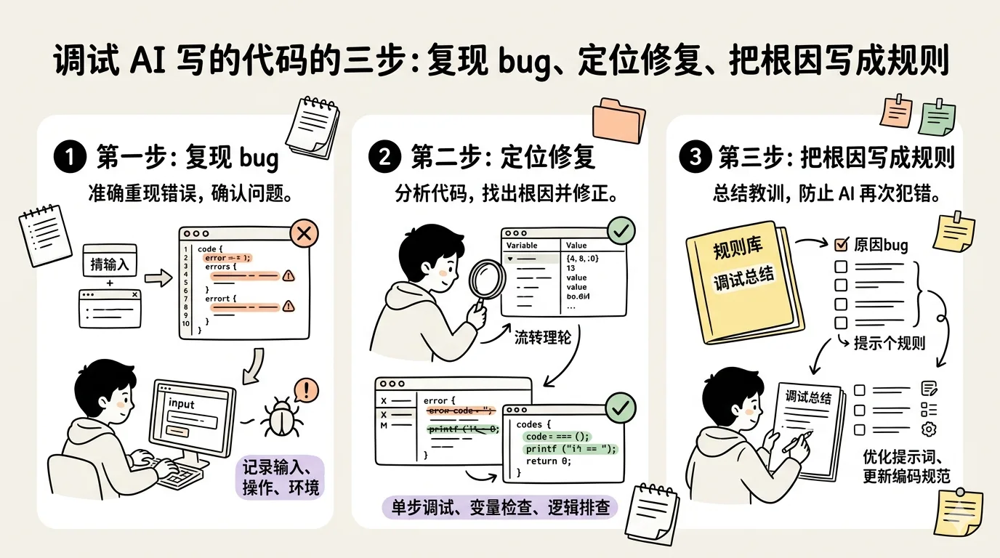</a><br/><b><code>flat-editorial</code></b><br/><sub>黑线 + 米白 + 克制柔彩高亮</sub></td>
<td align="center" valign="top" width="33%"><a href="#morandi"></a><br/><b><code>morandi</code></b><br/><sub>细黑线 + 莫兰迪低饱和灰调</sub></td>
</tr>
<tr>
<td align="center" valign="top" width="33%"><a href="#mint">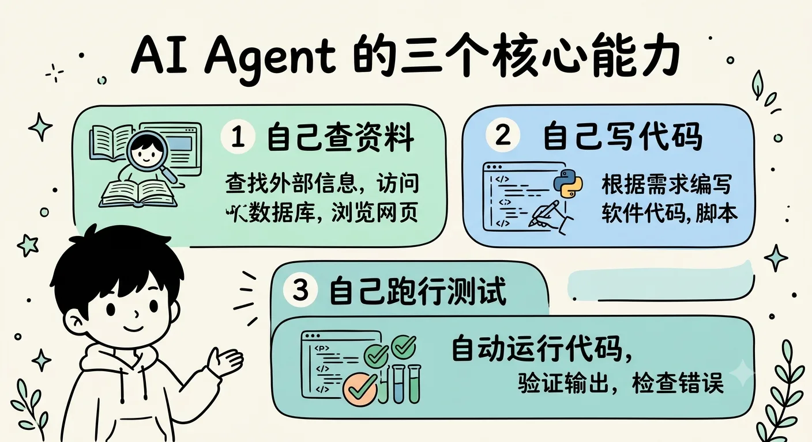</a><br/><b><code>mint</code></b><br/><sub>细黑线 + 薄荷绿/天蓝清爽</sub></td>
<td align="center" valign="top" width="33%"><a href="#blue"></a><br/><b><code>blue</code></b><br/><sub>细黑线 + 蓝调 + 橙点缀(偏技术)</sub></td>
<td align="center" valign="top" width="33%"><a href="#hand-drawn-blue">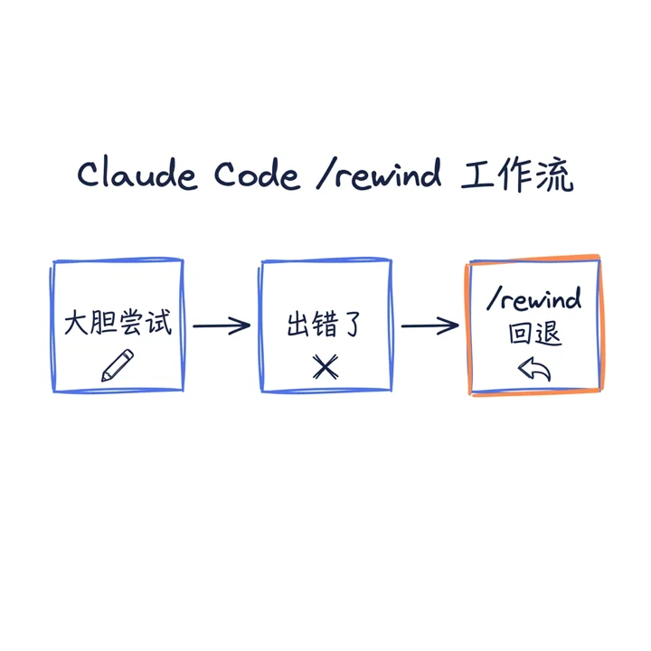</a><br/><b><code>hand-drawn-blue</code></b><br/><sub>手绘速写 + 蓝点缀(全能)</sub></td>
</tr>
</table>

### 💬 叙事漫画系 · 人物 + 对话气泡(3)

<table>
<tr>
<td align="center" valign="top" width="33%"><a href="#illustrated-warm"></a><br/><b><code>illustrated-warm</code></b><br/><sub>暖橙渐变 + 卡通人物 + 气泡</sub></td>
<td align="center" valign="top" width="33%"><a href="#meme-illustration">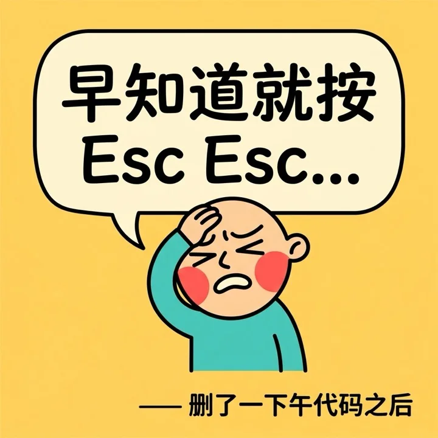</a><br/><b><code>meme-illustration</code></b><br/><sub>黄底 + 卡通 + 夸张梗图</sub></td>
<td align="center" valign="top" width="33%"><a href="#slice-of-life">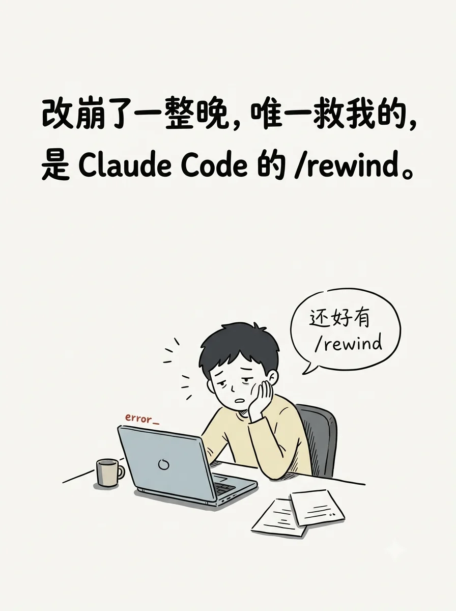</a><br/><b><code>slice-of-life</code></b> 🆕<br/><sub>细墨线 + 中性淡彩 + 单点红(治愈生活)</sub></td>
</tr>
</table>

### 🖊️ 荧光刷体大字卡系 · 白底刷体 + 荧光高亮(5,**卡片默认**)

<table>
<tr>
<td align="center" valign="top" width="20%"><a href="#marker-lime">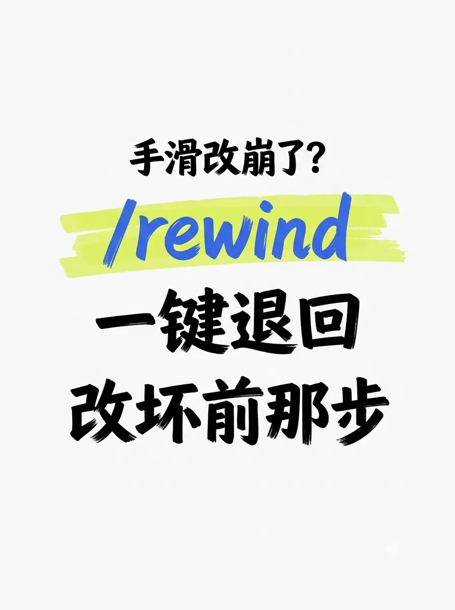</a><br/><b><code>marker-lime</code></b> ⭐<br/><sub>荧光黄绿 + 宝蓝(默认)</sub></td>
<td align="center" valign="top" width="20%"><a href="#marker-pink">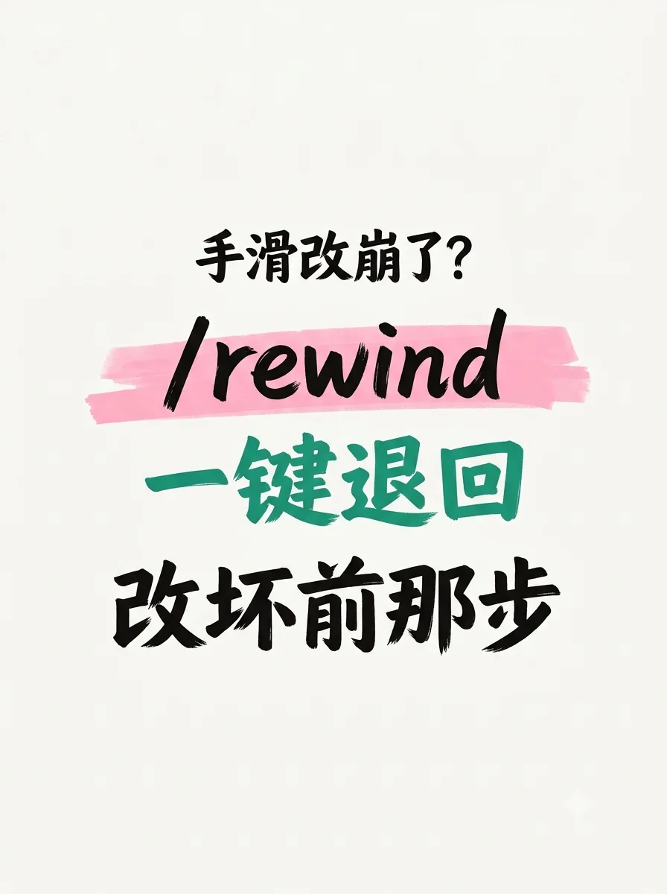</a><br/><b><code>marker-pink</code></b><br/><sub>樱粉 + 青绿</sub></td>
<td align="center" valign="top" width="20%"><a href="#marker-sky">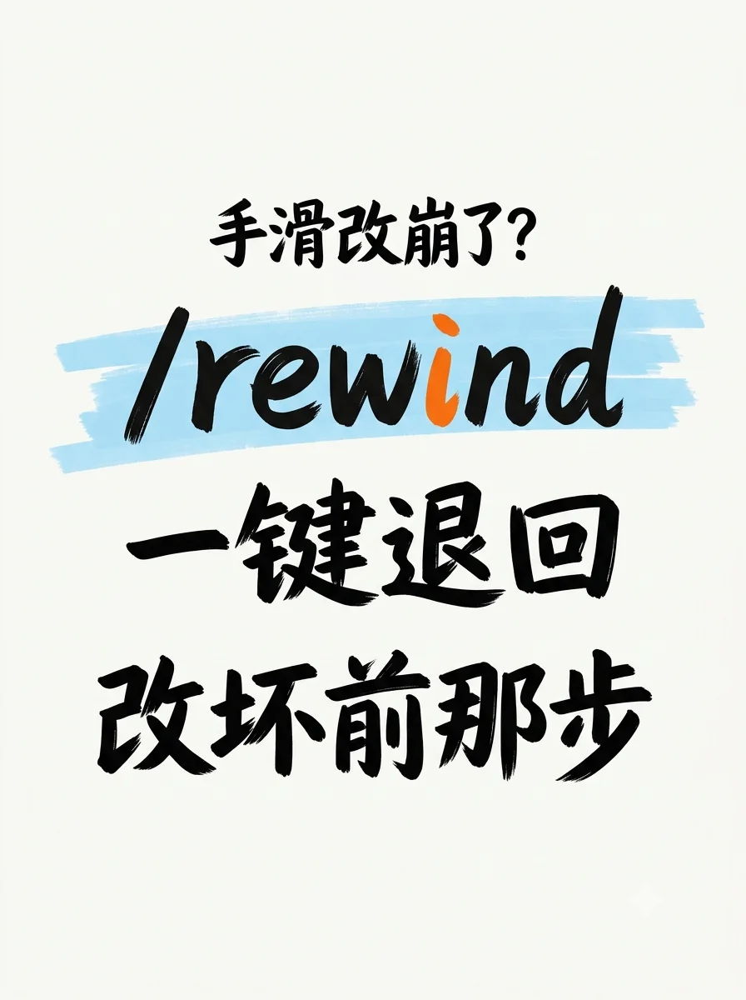</a><br/><b><code>marker-sky</code></b><br/><sub>天蓝 + 亮橙</sub></td>
<td align="center" valign="top" width="20%"><a href="#marker-coral">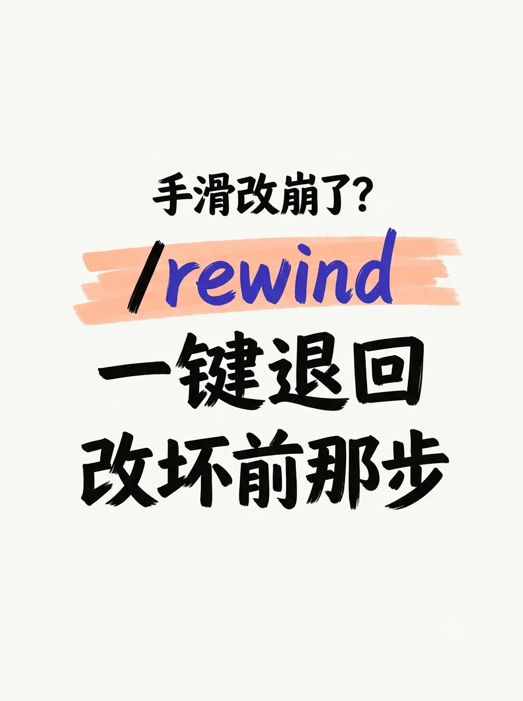</a><br/><b><code>marker-coral</code></b><br/><sub>珊瑚橙 + 靛蓝</sub></td>
<td align="center" valign="top" width="20%"><a href="#marker-violet">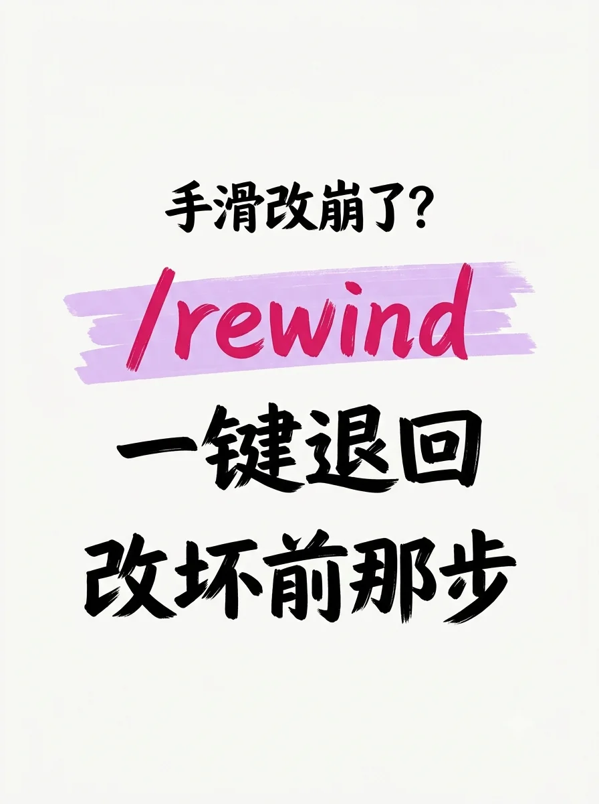</a><br/><b><code>marker-violet</code></b><br/><sub>藕紫 + 玫红</sub></td>
</tr>
</table>

### 🗂️ 卡片排版系 · 大字 + 结构(3)

<table>
<tr>
<td align="center" valign="top" width="33%"><a href="#knowledge-card">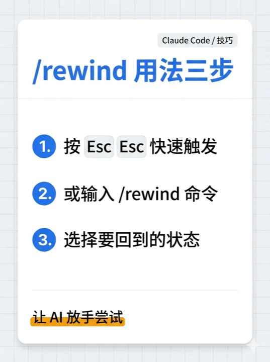</a><br/><b><code>knowledge-card</code></b><br/><sub>白底 + 编号徽章 + 结构化</sub></td>
<td align="center" valign="top" width="33%"><a href="#magazine-editorial">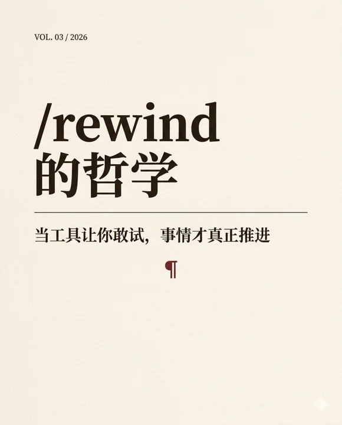</a><br/><b><code>magazine-editorial</code></b><br/><sub>米色 + 衬线大标题 + 栏位感</sub></td>
<td align="center" valign="top" width="33%"><a href="#xiaohongshu-colorful"></a><br/><b><code>xiaohongshu-colorful</code></b><br/><sub>暖色渐变 + emoji + 大字</sub></td>
</tr>
</table>

### 📈 数据系(1)

<table>
<tr>
<td align="center" valign="top" width="33%"><a href="#data-chart">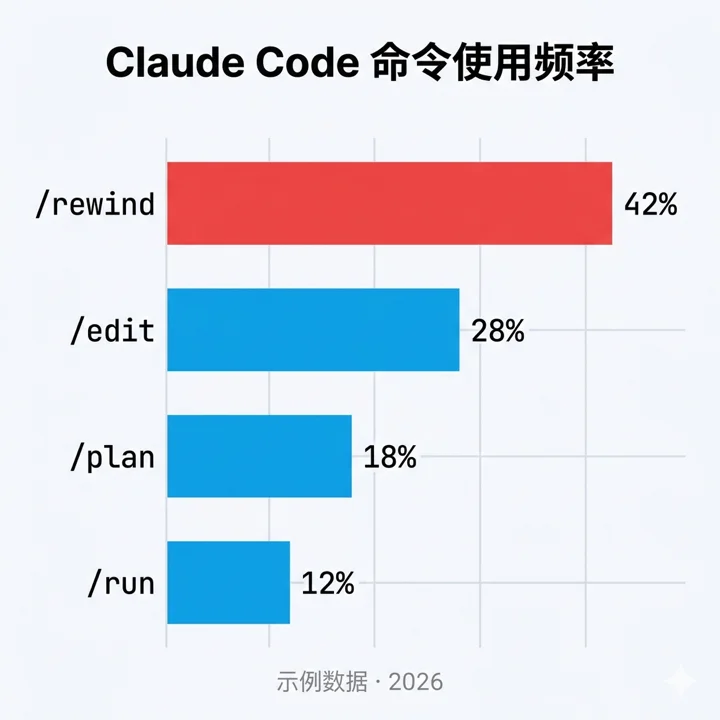</a><br/><b><code>data-chart</code></b><br/><sub>白底 + 图表 + 等宽数字(需真实数据)</sub></td>
<td width="33%"></td><td width="33%"></td>
</tr>
</table>

### 📊 高密度信息图系 · 手绘水彩 · 9:16 长图(4)

<table>
<tr>
<td align="center" valign="top" width="25%"><a href="#infographic-warm">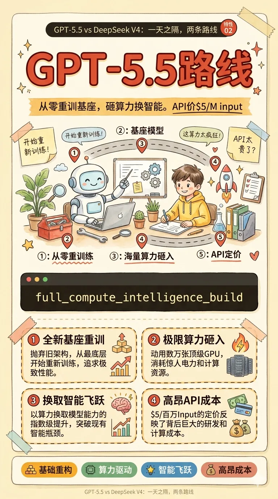</a><br/><b><code>infographic-warm</code></b> ⭐<br/><sub>暖黄手绘水彩(贴图默认)</sub></td>
<td align="center" valign="top" width="25%"><a href="#infographic-blue">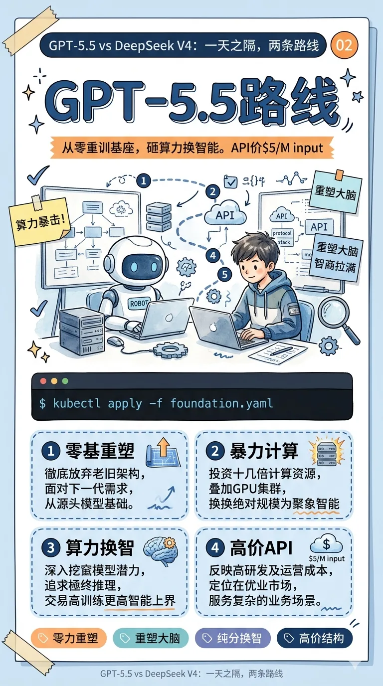</a><br/><b><code>infographic-blue</code></b> 🔥<br/><sub>冷蓝手绘水彩(SDK/协议)</sub></td>
<td align="center" valign="top" width="25%"><a href="#infographic-dark">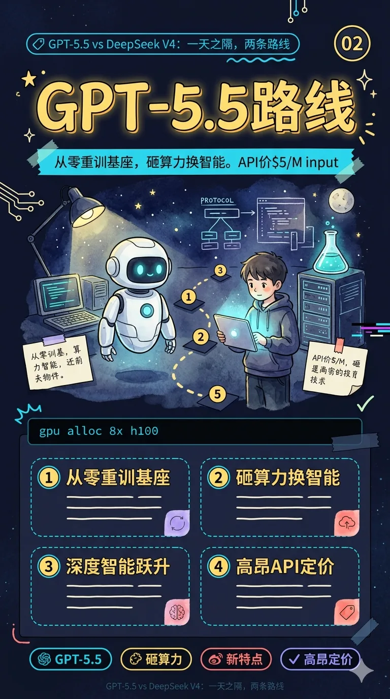</a><br/><b><code>infographic-dark</code></b> 🔥<br/><sub>深色手绘水彩(前沿/赛博)</sub></td>
<td align="center" valign="top" width="25%"><a href="#infographic-mint">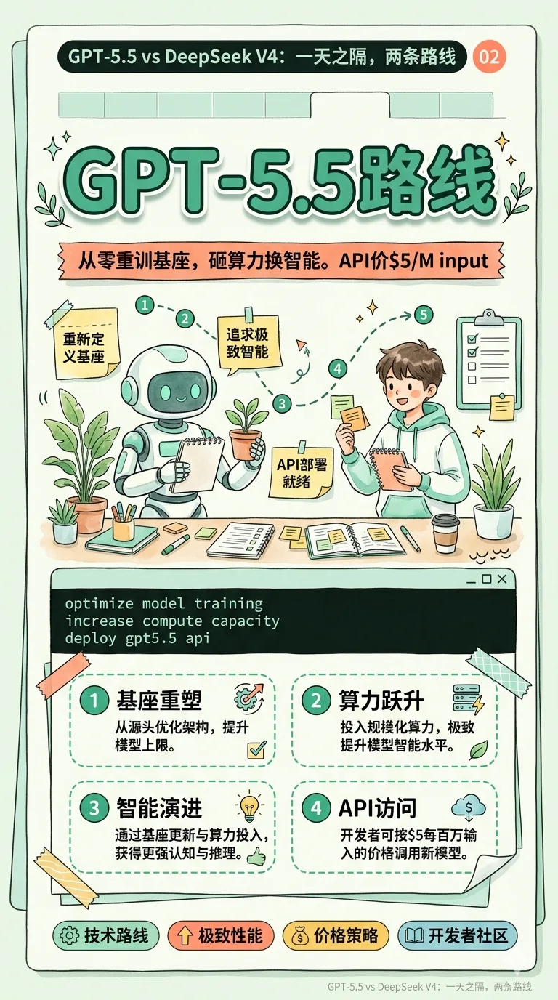</a><br/><b><code>infographic-mint</code></b> 🔥<br/><sub>薄荷手绘水彩(生产力)</sub></td>
</tr>
</table>

---

## 两种模式,两套默认

- **文章(news)模式默认**:`warm-handdrawn`(暖手绘:粉 + 暖黄手账卡片风,干净细黑线 + 米白留白)
- **贴图(newspic)模式默认**:`infographic-warm`(高密度手绘水彩信息图,暖黄配色)

两套默认是**有意分开**的 —— 文章里的配图是一图一意的插图(密度低),贴图整篇就是 6-10 张卡,每张需要自己承载完整信息(密度高)。**不要**把文章的 `warm-handdrawn` 拿来当贴图用,效果会像"草稿"。

账号可以在 `wechat-publisher.yaml` 分别配 `image_style` 和 `newspic_image_style`:

```yaml
accounts:
  main:
    image_style: "warm-handdrawn"        # 文章模式
    newspic_image_style: "infographic-warm"  # 贴图模式(参考图同款)
```

---

## 风格选择流程

1. 先看下面的**速查表**决定用哪一种风格
2. 预览图只是样例 —— 实际生成时会用你自己的内容
3. 在 `wechat-publisher.yaml` 的账号下配 `image_style: <name>` 和 `newspic_image_style: <name>`
4. 单篇要覆盖:`--image-style <name>`(CLI)或 brief.md frontmatter `image_style: <name>`

**优先级**:
- **文章**:CLI `--image-style` > frontmatter > 账号 `image_style` > `warm-handdrawn`
- **贴图**:CLI `--image-style` > frontmatter > 账号 `newspic_image_style` > `infographic-warm`

---

## 风格速查表

| 风格 | 视觉关键词 | 最适合的话题 | 密度 | 贴图 | 文章 |
|---|---|---|---|---|---|
| [`warm-handdrawn`](#warm-handdrawn) ⭐ | 细黑线 + 米白 + 粉/暖黄手账卡片 | 工具测评、功能对比、上手指南、概念科普(**文章默认**) | 中 | ✅ | ✅ 默认 |
| [`flat-editorial`](#flat-editorial) | 黑线 + 米白 + 克制柔彩(桃/绿/黄/紫高亮) | 步骤讲解、工具/功能对比、概念拆解、调试复盘 | 中 | ✅ | ✅ |
| [`morandi`](#morandi) | 细黑线 + 莫兰迪灰调(手账手写) | 人文、随笔、深度评论、有质感的内容 | 中 | ✅ | ✅ |
| [`mint`](#mint) | 细黑线 + 薄荷绿/天蓝(清爽冷调,手账) | 生产力、工具、效率、清单 | 中 | ✅ | ✅ |
| [`blue`](#blue) | 细黑线 + 蓝调 + 橙点缀(冷静偏技术,手账) | 技术、架构、协议、SDK、评测 | 中 | ✅ | ✅ |
| [`marker-lime`](#marker-lime) ⭐ | 白底刷体大字 + 荧光黄绿高亮 + 宝蓝强调 | 标题党、爆点、热评、金句、短观点(**卡片默认**) | 低 | ✅ | ✅ |
| [`marker-pink`](#marker-pink) | 白底刷体大字 + 樱粉高亮 + 青绿强调 | 同上,樱粉配色 | 低 | ✅ | ✅ |
| [`marker-sky`](#marker-sky) | 白底刷体大字 + 天蓝高亮 + 亮橙强调 | 同上,天蓝配色 | 低 | ✅ | ✅ |
| [`marker-coral`](#marker-coral) | 白底刷体大字 + 珊瑚橙高亮 + 靛蓝强调 | 同上,珊瑚配色 | 低 | ✅ | ✅ |
| [`marker-violet`](#marker-violet) | 白底刷体大字 + 藕紫高亮 + 玫红强调 | 同上,藕紫配色 | 低 | ✅ | ✅ |
| [`hand-drawn-blue`](#hand-drawn-blue) | 手绘线条 + 蓝点缀 | 概念解释、架构图、流程图(全能选手) | 中 | ✅ | ✅ |
| [`illustrated-warm`](#illustrated-warm) | 暖橙 + 卡通人物 + 气泡 | 体验讲解、使用指南、亲切感强的技巧 | 中 | ✅ | ✅ |
| [`xiaohongshu-colorful`](#xiaohongshu-colorful) | 暖色渐变 + emoji + 大字 | 生活提示、上手指南、清单类 | 中 | ✅ | ✅ |
| [`magazine-editorial`](#magazine-editorial) | 米色 + 衬线 + 栏位感 | 深度评论、专栏、长篇随笔 | 中 | ✅ | ✅ |
| [`knowledge-card`](#knowledge-card) | 白底 + 编号 + 结构化 | 教程、方法论、清单、复习卡 | 中 | ✅ | ✅ |
| [`data-chart`](#data-chart) | 白底 + 图表 + 数字 | 数据观察、行业报告、对比 | 中 | ✅ | ✅ |
| [`meme-illustration`](#meme-illustration) | 黄底 + 卡通 + 对话气泡 | 吐槽、段子、行业梗 | 低 | ✅ | ✅ |
| [`slice-of-life`](#slice-of-life) | 细墨线 + 中性淡彩 + 单点红(治愈系生活手绘) | 生活观察、打工人共鸣、段子、轻科普 | 低 | ✅ | ✅ |
| [`infographic-warm`](#infographic-warm) ⭐ | 暖色手绘 + 高密度信息图 | **贴图默认,通用话题** | **高** | ✅ | ✅ |
| [`infographic-blue`](#infographic-blue) 🔥 | 冷蓝手绘 + 高密度信息图 | **SDK/协议/产品拆解** | **高** | ✅ | ✅ |
| [`infographic-dark`](#infographic-dark) 🔥 | 深色手绘 + 高密度信息图 | **前沿模型、基建、赛博** | **高** | ✅ | ✅ |
| [`infographic-mint`](#infographic-mint) 🔥 | 薄荷手绘 + 高密度信息图 | **生产力/工具/方法论** | **高** | ✅ | ✅ |

### ⭐🔥 手绘水彩信息图系列

**4 种风格共享同一底层要求**:高密度中文信息图 + 手绘水彩 + 墨线插画 + 纸张纹理,像一页日本/台湾科普绘本或杂志插页。配色、布局、角色和画面元素都按主题自适应,不要固定成同一套机器人男孩模板。

**可选设计组件**(按内容组合,不要全部硬塞):
1. 顶部小标签(话题 + 卡片序号)
2. 粗体手绘大标题(带描边阴影)
3. 副标题横条 / 胶带 / 批注
4. 中部水彩插画场景 / 流程路径 / 架构图 / 对比图
5. 仿 terminal 黑条或命令片段(技术话题适用)
6. 2×2 要点网格 / 时间线 / 数据小图表 / checklist / before-after
7. 底部彩色标签胶囊带
8. 页脚水印或来源标注

角色是可选元素。可以用机器人、小男孩、开发者、用户、动物、设备、抽象图形或完全无人物,取决于这张卡最适合怎么解释信息。

**选配色的建议**:
- 不确定 / 通用 / 人文 / AI 产品 → `infographic-warm`(**默认**,暖黄参考图同款)
- 技术拆解 / SDK / 协议 / 商务分析 → `infographic-blue`(冷蓝)
- 前沿模型 / 基建 / 赛博 / 深夜科技 → `infographic-dark`(深夜档案)
- 生产力 / 工具 / 方法论 / 学习笔记 → `infographic-mint`(薄荷清新)

**⚠️ 使用前提**:要点本身要有具体信息(数字、名词、对比、步骤),AI 才能把子点渲染成 2×2 网格里的真内容。如果要点只有一句抽象观点,AI 会编数字 —— 那种情况下不如用 `marker-lime` 做刷体大字卡更稳。

---

## 风格详细说明

### warm-handdrawn

干净细黑线手绘 + 米白底 + 粉/暖黄两色平涂 + 编辑式卡片排版。顶部黑色手写大标题,关键词黄荧光涂或粉色手绘下划线;圆角胶囊卡装内容,粉点 bullet、小星星点缀;小人黑发点眼黄连帽衫。**文章模式默认**,清爽亲切、留白多、文字精简。

<table>
<tr><td width="300">

</td><td>

- **主题色**:`#fdf6ec` 米白底 / `#f3a3bf` 粉 / `#fbd24e` 暖黄 / `#222` 黑线
- **排版**:16:9 文章 / 3:4 贴图,黑色手写标题 + 卡片
- **最适合**:工具测评、功能对比、上手指南、概念科普
- **别用在**:纯数据报告(换 `data-chart`)、需要人物讲故事(换 `illustrated-warm`)、冷硬架构(换 `hand-drawn-blue`)
- **跨 skill**:与 x-publisher 的 `warm-handdrawn` 同名同风格,一个名两处复用

</td></tr></table>

---

### flat-editorial

细黑线手绘 + 手写体标题 + 米白/白卡 + 克制柔彩高亮的手账式结构信息图。细而利落的黑线、实心黑发连帽衫小人、黑色数字圆圈分步;代码窗口 mock(绿=修复 / 桃=报错 / 红波浪线)、便签、文件夹、对勾、扁平小图标。和暖手绘一样走手账+手写,但配色是黑+米白为主、柔彩多色只做语义高亮,信息密度更高。

<table>
<tr><td width="300">

</td><td>

- **主题色**:`#f6f4ef` 米白底 / `#1f1f1f` 黑 / 柔彩高亮 桃`#f4a261`·绿`#a8d3a6`·黄`#fbe7a2`·紫`#d3c5ea`
- **排版**:16:9 文章 / 3:4 贴图,粗黑标题 + 数字步骤 + 白卡
- **最适合**:步骤讲解、工具/功能对比、概念拆解、调试/工作流复盘
- **别用在**:纯氛围/生活(换 `warm-handdrawn` 或 `illustrated-warm`)、纯数据(换 `data-chart`)
- **跨 skill**:与 x-publisher 的 `flat-editorial` 同名同风格,一个名两处复用

</td></tr></table>

---

> 下面 `morandi` / `mint` / `blue` 与 `warm-handdrawn` / `flat-editorial` 是**同一套手绘 + 手写体 + 细黑线 + 手账** treatment,只换配色。按话题情绪选:技术→`blue`/`flat-editorial`,轻松→`warm-handdrawn`/`mint`,人文→`morandi`。

### morandi

细黑线手绘 + 手写体标题 + 莫兰迪低饱和配色(灰绿/脏粉/灰蓝/陶土)。高级、克制、安静,适合人文、随笔、深度评论。

<table>
<tr><td width="300">

</td><td>

- **主题色**:`#f4f1ea` 米白底 / 莫兰迪 灰绿`#9caf9a`·脏粉`#c8a9a6`·灰蓝`#9aa8b5`·陶土`#bb9c8a` / `#2a2a2a` 黑线
- **最适合**:人文、随笔、文化、有质感的深度内容
- **跨 skill**:与 x-publisher 的 `morandi` 同名同风格

</td></tr></table>

---

### mint

细黑线手绘 + 手写体标题 + 薄荷绿/天蓝清爽冷调 + 大留白。干净、利落、有呼吸感,适合生产力、工具、效率、清单。

<table>
<tr><td width="300">

</td><td>

- **主题色**:`#f5faf8` 米白底 / 薄荷`#9fdcc8`·天蓝`#a8d3ea`·青绿`#7fc4be` + 小桃点`#f4b89a` / `#222` 黑线
- **最适合**:生产力、工具、效率方法、清单、上手指南
- **跨 skill**:与 x-publisher 的 `mint` 同名同风格

</td></tr></table>

---

### blue

细黑线手绘 + 手写体标题 + 蓝调(蓝+浅蓝+橙点缀)。冷静、偏工程,适合技术、架构、协议、SDK、评测(走手账手写,冷静偏工程的技术话题首选)。

<table>
<tr><td width="300">

</td><td>

- **主题色**:`#f4f7fb` 米白底 / 蓝`#4a6cf7`·浅蓝`#a9c2f5` + 小橙点`#ff8c42` / `#222` 黑线
- **最适合**:技术、架构、协议、SDK 拆解、模型评测
- **跨 skill**:与 x-publisher 的 `blue` 同名同风格

</td></tr></table>

---

### 荧光刷体大字卡系(marker-*)⭐ 卡片默认

白底 + 粗刷体大字(干笔飞白)+ 一道荧光笔高亮压在关键行 + 单个关键词强调色,居中大留白。纯文字大字卡,标题党 / 爆点 / 热评气质,手作感强。**取代旧的 `tech-card-blue` / `quote-card-minimal` 两款极简大字卡**,作为卡片类推荐默认(`tech` 账号 `image_style` 默认已切到 `marker-lime`)。

**共享 DNA / 四条铁律**:①字号分层——小引子 ≈ 大字的 55%,大爆点中等不夸张,**三行大字之间强制留大行距(≥0.6 字高)、绝不贴成块**;②文字块只占画面 ~40%、四周大留白,字小而透气、不铺满;③全卡只一道**干刷、有笔触条纹、边缘毛糙半透明**的荧光高亮,只压第一行大字;④只一个词上强调色,其余近黑 `#1a1a1a`,白底不铺色不加框。5 个变体只换「高亮色 + 强调色」这一对。

> **⚠️ 字体一致**:纯文字卡最吃字体,模型渲染中文会飘、刷体难稳。要真·一致就走「白底只出高亮 + 版式,文字用固定刷体后期叠」(中文汉仪雅酷黑 / 站酷庆科黄油体,英文 Permanent Marker / Caveat)。一步到位出字时,卡面控制在 ≤14 字、短句分行,出错率更低。

#### marker-lime

⭐ **卡片类推荐默认 + `tech` 账号 `image_style` 默认**。

<table>
<tr><td width="300">

</td><td>

- **配色**:高亮 荧光黄绿 `#cfe84a` + 强调 矢车菊蓝 `#3a6fe5` / 近黑 `#1a1a1a` / 白底 `#ffffff`
- **排版**:3:4 贴图 / 4:3 文章,粗刷体中文 + 随性手写拉丁
- **账号绑定**:`tech`(蒜是哪根葱)默认;卡片类全局推荐默认
- **最适合**:标题党、爆点、热评、金句、短观点
- **别用在**:长文深度解析、需要人物场景(换 `slice-of-life`)、高密度信息(换 `infographic-*`)

</td></tr></table>

**纯净模板参考**(展示风格骨架:小引子 + 高亮首行 + 大字分行,不带具体文案):

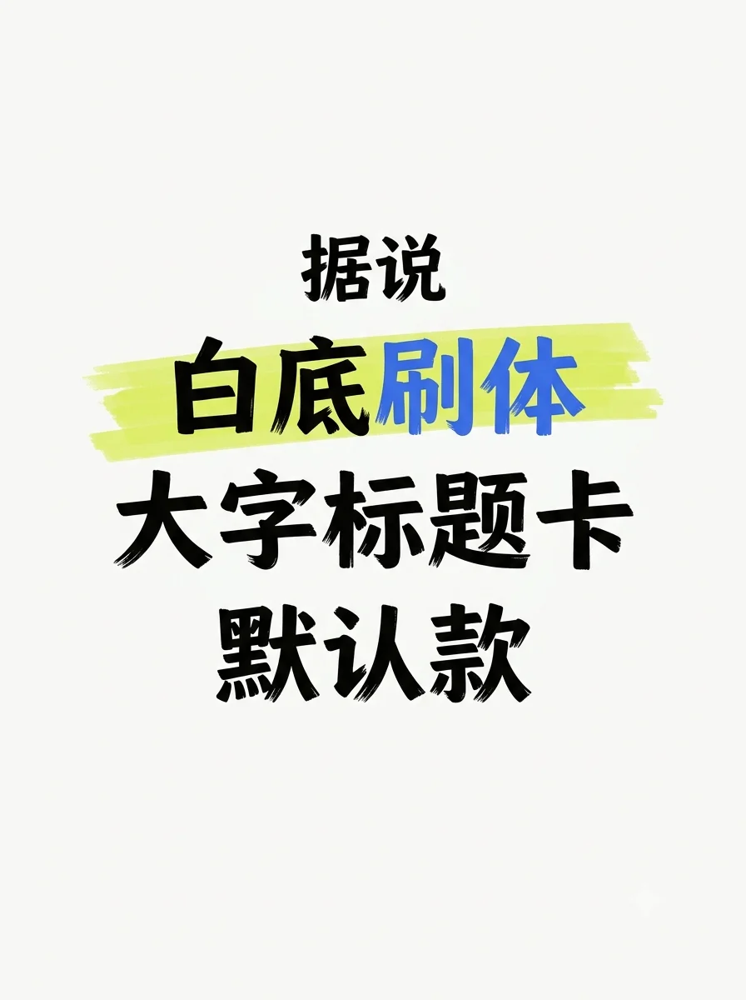

#### marker-pink

<table><tr><td width="240">

</td><td>

- **配色**:高亮 樱粉 `#ffb6ce` + 强调 青绿 `#17a67a`
- 其余同 `marker-lime`(白底刷体大字 + 一道高亮 + 单词强调 + 大留白)

</td></tr></table>

#### marker-sky

<table><tr><td width="240">

</td><td>

- **配色**:高亮 天蓝 `#a9def9` + 强调 亮橙 `#f97316`
- 其余同 `marker-lime`

</td></tr></table>

#### marker-coral

<table><tr><td width="240">

</td><td>

- **配色**:高亮 珊瑚橙 `#ffc4a3` + 强调 靛蓝 `#4f46e5`
- 其余同 `marker-lime`

</td></tr></table>

#### marker-violet

<table><tr><td width="240">

</td><td>

- **配色**:高亮 藕紫 `#d9c2f0` + 强调 玫红 `#e11d6b`
- 其余同 `marker-lime`

</td></tr></table>

---

### hand-drawn-blue

手绘速写风 + 蓝色点缀 + 白底,像工程师的笔记本。擅长画流程、架构、对比、概念示意。
视觉一致度高,话题适配广,冷硬技术话题(架构/协议/流程)的备选。

<table>
<tr><td width="300">

</td><td>

- **主题色**:`#ffffff` 底 / `#4a6cf7` 蓝 / `#ff8c42` 橙
- **排版**:支持 1:1 贴图 / 16:9 文章,手写风字体
- **账号绑定**:`main`(刷屏AI)默认
- **最适合**:AI / 产品 / 工程话题的全能默认
- **别用在**:纯数据报告(换 `data-chart`)、纯金句大字(换 `marker-lime`)

</td></tr></table>

---

### illustrated-warm

暖橙 / 桃色渐变底 + 卡通人物场景 + 大白气泡 + 手绘装饰。每张卡像一页小漫画,讲一个小故事。
**对标公众号示例文章 [Claude Code /rewind](https://mp.weixin.qq.com/s/erEF74HRGkrBPxTGsKDsSQ)**。视觉有温度、带情绪、有人物在场,适合"给你讲一件事"感觉的内容。

<table>
<tr><td width="300">

</td><td>

- **主题色**:`#ffd9b3 → #ffa07a` 暖橙渐变 / `#4ecdc4` 青 / `#a78bfa` 紫 / `#fde047` 黄
- **排版**:3:4 竖图(贴图)/ 4:3(文章),粗圆体 + 手写感
- **账号绑定**:(main 号讲使用体验时首选)
- **最适合**:工具使用讲解、体验分享、故事卡、亲切感强的"指南"
- **别用在**:冷话题(数据、架构、协议),情绪不匹配时看着反而跳

</td></tr></table>

---

### xiaohongshu-colorful

暖色渐变背景 + emoji + 大字 + 黄色笔刷高亮,典型的小红书 / Instagram 封面感。
活泼、友好、转化率高。

<table>
<tr><td width="300">

</td><td>

- **主题色**:`#ffecd2 → #fcb69f` 渐变 / `#ff6b6b` 红 / `#ffd93d` 黄
- **排版**:3:4 竖图(贴图)/ 16:9(文章)
- **账号绑定**:(可选,main 号做生活类时用)
- **最适合**:上手指南、清单盘点、生活提示、轻话题
- **别用在**:tech 号葱哥(冷幽默和彩色完全不搭)

</td></tr></table>

---

### magazine-editorial

米色暖底 + 衬线大标题 + 栏位感 + 栗色点缀。像杂志内页,有温度也有距离感。
文章开头配一张,全文格调瞬间提一档。

<table>
<tr><td width="300">

</td><td>

- **主题色**:`#f5efe6` 米色 / `#7a2e2e` 栗 / `#4a5d3a` 墨绿
- **排版**:4:5 竖图(贴图)/ 16:9(文章),思源宋体 Heavy
- **账号绑定**:(深度评论专栏用)
- **最适合**:深度观察、行业评论、文化思考、长篇随笔
- **搭配主题**:`sage-premium` / `warm-editorial` 效果最好

</td></tr></table>

---

### knowledge-card

白底 + 浅灰栅格 + 蓝色编号徽章 + 琥珀色小结。结构化学习卡的标准模板。
信息密度高,视觉识别度高,读者一眼就知道"这是要记的"。

<table>
<tr><td width="300">

</td><td>

- **主题色**:`#ffffff` 底 / `#2563eb` 蓝 / `#f59e0b` 琥珀
- **排版**:3:4(贴图)/ 16:9(文章),思源黑体 Bold
- **账号绑定**:(工具教程、方法论类用)
- **最适合**:教程步骤、方法框架、清单、概念拆解
- **别用在**:情绪型内容、纯金句大字(换 `marker-lime`)

</td></tr></table>

---

### data-chart

白底 + 栅格 + 柱图 / 折线 / 饼图 + 等宽数字。FiveThirtyEight / Bloomberg 数据图美学。
**只有真实数字才用这个风格** —— 编数据会掉粉比 AI 味还严重。

<table>
<tr><td width="300">

</td><td>

- **主题色**:`#fafbfc` 底 / `#0ea5e9` 蓝 / `#ef4444` 红 / `#10b981` 绿
- **排版**:1:1(贴图)/ 16:9(文章),JetBrains Mono 等宽数字
- **账号绑定**:(有数据的文章通用)
- **最适合**:趋势分析、榜单、行业报告、benchmark 对比
- **硬要求**:必须有真实可引用的数据源

</td></tr></table>

---

### meme-illustration

黄底 + 卡通人物 + 对话气泡 + 夸张表情。互联网 meme 风格,专治严肃。
**慎用**:meme 有保鲜期,过时的梗比没梗还尴尬。

<table>
<tr><td width="300">

</td><td>

- **主题色**:`#fff9e6` 黄底 / `#ff5e5e` 红 / `#4ecdc4` 青 / `#2d2d2d` 黑线
- **排版**:1:1(贴图)/ 4:3(文章),粗黑体 + 手写风
- **账号绑定**:(tech 号文末吐槽)
- **最适合**:吐槽、行业段子、相亲相爱型梗、程序员幽默
- **别用在**:严肃观点、首图、跟客户 / 品牌合作的文章

</td></tr></table>

---

### slice-of-life

细钢笔线描 + 低饱和淡彩平涂 + 大量纸白留白,全图仅一处砖红点睛。顶部手写体旁白直译笑点,下方手绘场景配对话气泡和情绪小符号(说话放射线 / 速度线)。治愈系生活手绘,温、克制、带冷幽默。和 `meme-illustration`(黄底粗描边夸张)、`illustrated-warm`(暖橙渐变)是三条不同的路:本风格中性留白、细墨线、克制淡彩。

<table>
<tr><td width="300">

</td><td>

- **主题色**:`#fcfbf7` 纸白底 / `#2b2b2b` 软黑墨线 / 蓝灰`#b9c9ce`·米黄`#efe3bf`·中灰`#8a8d90`·炭灰`#3a3d42` / 砖红`#b83a2e`(全图唯一暖红,极小面积)
- **排版**:3:4 贴图 / 4:3 文章,顶部手写旁白 + 下方手绘场景 + 对话气泡
- **最适合**:生活观察、打工人共鸣、段子文案、亲切轻科普
- **别用在**:纯数据(换 `data-chart`)、冷硬架构(换 `hand-drawn-blue`)、高密度信息贴图(换 infographic 系列)
- **三条铁律**:①全图只留一处砖红,多加就俗;②线要细、要有手抖感,画太干净丢治愈感;③背景纯白留白,不铺底色
- **⚠️ 字体一致**:模型渲染小号中文会飘,要真·一致走"无字插画 + 后期叠字"(旁白站酷快乐体 / 招牌思源黑体)

</td></tr></table>

---

### infographic-warm

⭐ **贴图模式默认**。暖色手绘水彩 + 高密度中文信息图。适合做贴图默认视觉,但不固定角色、区块和装饰元素。

<table>
<tr><td width="300">

</td><td>

- **主题色**:`#faf0d4` 暖米黄 / `#e8543a` 红橙(标题) / `#f5a623` 琥珀 / `#3a2a1c` 深棕文字
- **排版**:9:16 竖版(1080x1920),手写粗体标题 + 思源黑体正文
- **视觉语言**:手绘水彩 + 墨线 + 纸张纹理,绝不用 flat vector / 3D
- **设计**:按内容选择布局和元素;可有人物/机器人,也可用图表、流程、设备或抽象符号
- **最适合**:贴图模式默认、AI 产品、工具讲解、人文趋势、通用话题
- **别用在**:如果你只想要一句大字标题卡(用 `marker-lime`)

</td></tr></table>

---

### infographic-blue

🔥 和 warm 同一手绘水彩语言,但换冷蓝基底 + 橙色强调,工程师气质。

<table>
<tr><td width="300">

</td><td>

- **主题色**:`#eaf2fb` 淡蓝 / `#2a62a8` 海军蓝(标题) / `#f58a3a` 橙 / `#102a44` 墨蓝文字
- **排版**:9:16 竖版,按内容选择架构图、对比栏、流程路径、要点网格或数据块
- **设计**:角色可选;技术话题优先用服务器、架构图、协议栈、终端、API 节点等元素
- **最适合**:SDK 拆解、协议对比、基础设施、产品评测、商务/技术并重的话题
- **别用在**:生活化话题、情绪型内容

</td></tr></table>

---

### infographic-dark

🔥 同视觉语言的深色变体。深靛蓝夜空底 + 霓虹青黄手绘,像夜间实验室档案。

<table>
<tr><td width="300">

</td><td>

- **主题色**:`#151a2e` 深靛蓝夜 / `#fde38a` 亮黄(标题) / `#22d3ee` 霓虹青 / `#f1ecd8` 奶油文字
- **排版**:9:16 竖版,按内容选择夜间档案、实验记录、威胁地图、流程追踪或数据面板
- **设计**:角色可选;更适合暗色图表、终端、节点网络、研究笔记、警示标记
- **最适合**:前沿模型发布、协议规范、基建/安全、赛博话题
- **别用在**:生活化 / 温暖向 / 面向非技术读者的话题

</td></tr></table>

---

### infographic-mint

🔥 同视觉语言的清新变体。米白底 + 薄荷绿 + 珊瑚橙,友好感强。

<table>
<tr><td width="300">

</td><td>

- **主题色**:`#f2f8ef` 淡薄荷 / `#2d9e7a` 薄荷绿(标题) / `#ff7b5d` 珊瑚 / `#1e2a26` 森林文字
- **排版**:9:16 竖版,按内容选择清单、步骤卡、学习笔记、工作台、方法论框架
- **设计**:角色可选;更适合桌面、便利贴、植物、清单、书本、白板等轻量元素
- **最适合**:生产力 / 工具使用 / 方法论 / 学习笔记 / 轻科普
- **别用在**:严肃商业分析、赛博话题

</td></tr></table>

---

## 新增一种风格

1. 在 `assets/image-styles/` 下复制一个现有 `.json` 作模板
2. 改 `style_name`(文件名同步改)、`display_name`、`description`
3. 设计 `prompt_template.newspic_card` 和 `prompt_template.article_inline`,可用占位符:
   - `{topic}` — brief.md 的 topic 字段
   - `{card_main}` / `{card_sub}` — 切分后的卡片主/副文字(老风格用这两个)
   - `{point_full}` — 完整原始要点(未切分),信息图类新风格用这个拿更多上下文
   - `{card_index}` / `{card_total}` — "01" / "06",渲染卡片序号
   - `{image_subject}` — "topic - card_main" 拼接,兼容用
4. 用项目内置 `scripts/generate_image.py` 按 `newspic_card` prompt 生成一张 1:1 预览图,然后 `cwebp -q 85 src.png -o previews/<style_name>.webp`(PNG 在 repo 里会占 10-20 倍空间)
5. 在本 README 加一行速查表 + 一个详细块
6. `python3 scripts/wechat_api.py list-image-styles` 验证能读出

---

## 调试

```bash
# 列出所有已注册风格
python3 scripts/wechat_api.py list-image-styles

# 看某个风格的完整 JSON
cat assets/image-styles/marker-lime.json | python3 -m json.tool

# 单独跑拆卡 + 出图计划(不实际生图)
python3 scripts/newspic_build.py brief.md --dry-run
```
