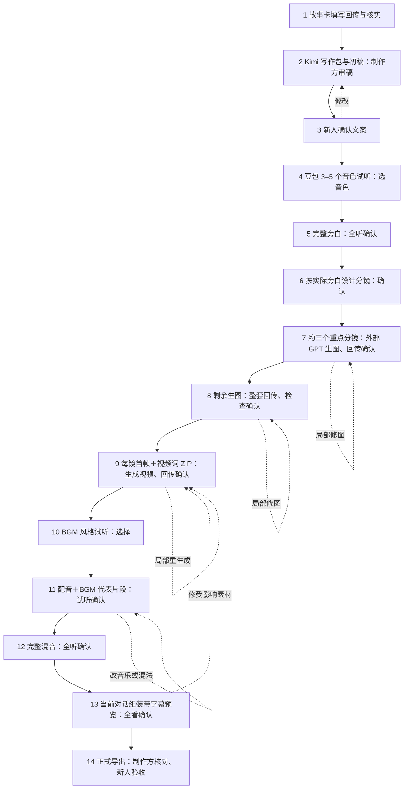

# 婚礼视频定制向导

**中文** | [English](README.en.md)

一个从真实故事采集到带字幕成片的 **14 步引导式 Skill**。每次只告诉制作方当前要做什么、返回什么、谁来确认，完成后再进入下一步。

[打开故事采集卡](https://aaronyi97.github.io/wedding-video-guided-wizard/) · [下载 Skill](https://github.com/aaronyi97/wedding-video-guided-wizard/releases/latest) · [完整操作说明](references/workflow.md)

采集卡沿用作者已有的五幕问卷，保留原来的问题、选项和版式。发给新人，电脑或手机填写后一键复制，通过微信等聊天方式发回；照片原图另发。卡片不要求手机号、账号或后台提交。网页本地保存文字草稿，可以清空。

中文是默认使用语言。英文用户可阅读 [English README](README.en.md)，直接用英语启动同一个 Skill；采集卡顶部可切换中英文，写作/视频文件包和阶段引导也提供英文。切换界面不会翻译或重写已确认内容。

## 安装与开始

把这段话发给 Codex：

> 请使用 skill-installer 从 https://github.com/aaronyi97/wedding-video-guided-wizard 安装 Skill。Skill 位于仓库根目录，安装名用 wedding-video-guided-wizard。安装后告诉我如何在下一轮启动。

也可将 Release ZIP 解压为 `wedding-video-guided-wizard` 文件夹，放进支持 `SKILL.md` 的工具所配置的技能目录。运行工具需具备本地文件与命令能力；不同宿主的自动发现和媒体工具支持按其实际配置核对。

启动时说：

> 使用 $wedding-video-guided-wizard 开始一单婚礼视频。先给我能发给新人的故事采集卡，再逐步带我完成。

续做时给本单项目目录，助手读取 `PROJECT_STATE.json` 后继续。客户资料和生成物始终放独立订单目录，不放此公开仓库。

## 过程与人的介入点

每轮开头例如：**【7/14｜三个重点分镜试图｜等待图片回传｜后续还剩 7 步】**。



每一步都有材料返回或明确的人类判断。第 3 步由新人确认，第 14 步由制作方核对后再由新人验收；其他步骤由制作方审核。回退不清空无关成果，不增加步骤总数。

## 核心约束

- **可以演绎表达，不能虚构经历。** 文案和每个分镜都能回溯到本单故事卡或已确认补充，不把示例剧情套给所有新人。
- **强烈建议 Kimi K3 写文案。** 写作包为 ZIP＋独立可复制全文，嵌入本单事实、叙事安排和「白描而有文采、自然口播、克制真挚」的写作方法。
- **生图始终由使用者在外部 GPT 对话操作。** 上传明确标注的参考图＋复制提示词；即使配置了 API，Codex 也不自动生图、修图或点击生成。
- **完整旁白先于正式分镜。** 按真实配音和情绪留白安排画面，减少后期硬凑时长。
- **声音与画面都先试听/试图，再铺开。** 视频词依据实际选用首帧；BGM 推荐 Suno V5.5，也可使用用户选择的可用服务或手动生成。
- **确认绑定版本。** 技术检测、助手审查、制作方听看、新人验收分别记录；文件生成成功不等于满意。

## 运行范围

`wizard.py` 管理 14 步状态、批准依据、文件指纹、返工及写作/视频 ZIP。`media.py` 提供可选的官方 Kimi、豆包 TTS 调用，以及本地混音、中英文烧录字幕、视频组装。没有内置生图入口，也没有猜测的通用 Suno/视频 API。

文字/配音接口需要用户自己的账号、有效配置和本单授权。视频与音乐可接入用户已有可用工具，或交手动提示词包再接回素材。账号或模型不可用时明确引导，不把推荐型号当作可用保证。

状态与文字打包需 Python 3.9+；首帧校验需 Pillow；本地混音剪辑需 FFmpeg、ffprobe、Pillow 及中文字体。助手到相关步骤才检查并指导配置，不在开场要求配置所有 API。参见[执行指南](references/execution.md)。

## 检查与贡献

```bash
python3 -m pip install Pillow
python3 -m unittest discover -s tests -v
python3 scripts/media.py doctor
```

可选实跑：`python3 tests/integration_smoke.py --output /absolute/path/to/new-test-project`。输出必须是新目录，用宿主允许的素材存储位置。只有合成测试色块/声音，不调用付费生成服务。

网页检查：先用 `python3 -m http.server 8734 --bind 127.0.0.1 --directory docs` 打开本地卡片，再用安装了 Playwright 的 Node 环境运行 `node tests/browser-smoke.cjs`。可通过 `BROWSER_BIN` 指定浏览器。

具体覆盖范围和限制见 [VALIDATION.md](VALIDATION.md)。提交问题时请去掉真实姓名、照片、完整客户故事与密钥；合成用例更便于复现。

## 来源与许可

这是独立的新 Skill。主动引导方式参考作者的 [image-story-video-wizard](https://github.com/aaronyi97/image-story-video-wizard)，采集卡复用作者已有 `wedding-story-video-wizard` 五幕问卷，按「填写 → 复制 → 聊天回传」调整交付方式与手机适配。没有附带真实客户故事、照片或音频。

[MIT](LICENSE)。保留原问卷所沿用的版权声明。
